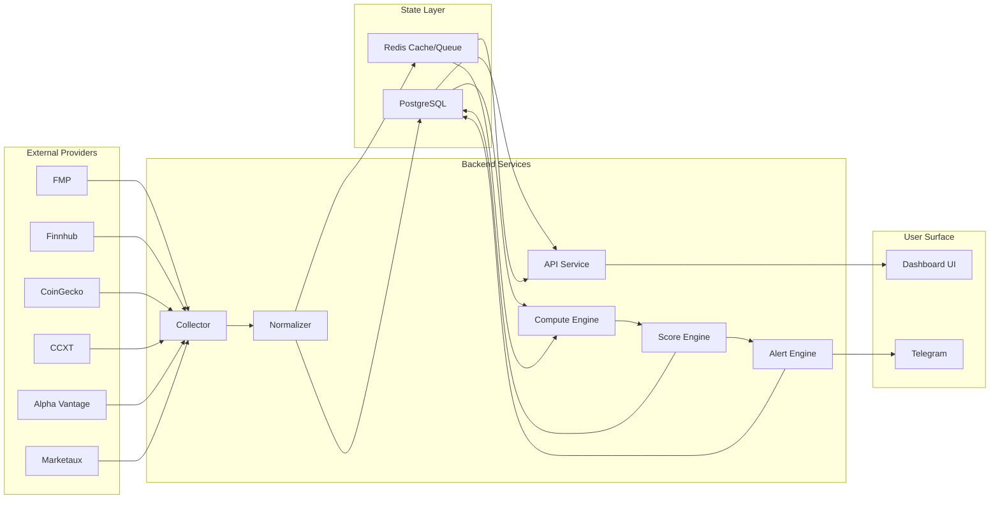
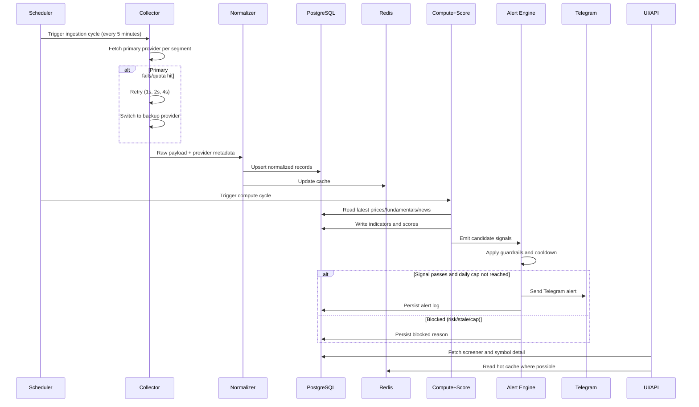

# Architecture and Data Flow (Day 6)

Date: 22 April 2026
Owner: Prash
Mode: Personal, home server, swing timeframe

## 1) Architecture Overview

## 2) Runtime Data Flow

## 3) Service Responsibilities

- `collector`: provider calls, retries, quota-aware routing, fallback selection.
- `normalizer`: schema mapping, quality flags, idempotent writes.
- `compute`: indicator and fundamentals calculations.
- `score`: composite score and signal generation.
- `alert`: guardrails, daily cap (`5/day`), cooldown, Telegram dispatch.
- `api/ui`: read-only decision surface with explanation context.

## 4) Failure and Recovery Paths

| Failure Scenario | Detection | Immediate Action | Recovery |
|---|---|---|---|
| Primary provider timeout/rate-limit | HTTP timeout/429 metrics | Retry + switch to backup | Auto-retry primary next cycle |
| Both providers fail for a segment | Ingestion cycle status | Use cached value if within staleness window | Mark `data_unavailable`, retry next cycle |
| DB unavailable | Health check + write error | Pause writes and queue raw payload in Redis | Replay queued data after DB recovery |
| Redis unavailable | Cache/queue health check | Continue DB-only mode | Restore cache gradually from DB reads |
| Telegram failure | Alert dispatch error | Retry send up to 3 attempts | Persist unsent alert for later replay |
| Job overlap or delay | Scheduler lag metric | Skip duplicate run if lock exists | Resume normal cadence next cycle |
| Stale data exceeds threshold | Freshness monitor | Block `Strong Buy` for stale assets | Refresh data and re-score |

## 5) Runbook Notes (Home Server)

### Daily Start Checks
- Confirm `API`, `Postgres`, and `Redis` health.
- Confirm provider key validity and quota headroom.
- Run one test ingestion per segment (`US`, `NSE`, `Crypto`).
- Send one Telegram test alert.

### During Market Hours
- Watch ingestion success rate and cycle latency.
- Track provider `429` rate and switch pressure.
- Validate alert cap enforcement and cooldown behavior.

### End-of-Day Checks
- Confirm all scheduled jobs completed.
- Review blocked alerts and reasons.
- Verify backup snapshot/DB backup completion.

### Incident Quick Actions
- Provider outage: force backup provider routing for affected segment.
- DB incident: switch to degraded mode and queue writes in Redis.
- Alert incident: pause live alerts, keep scoring active, replay later.

## 6) SLO Alignment

- Data freshness target: <= 5 minutes on active watchlist symbols.
- Job success target: >= 99% over rolling 7 days.
- Alert dispatch target: <= 90 seconds from signal creation.
- API read target: <= 400 ms p95 on local network.

## 7) Day 6 Definition of Done

Day 6 is complete when:
- end-to-end architecture is documented
- ingestion-to-alert data flow is explicit
- failure/recovery paths are defined
- daily operations runbook is available
